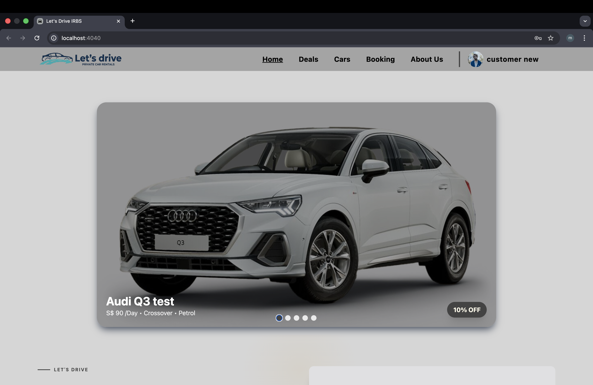
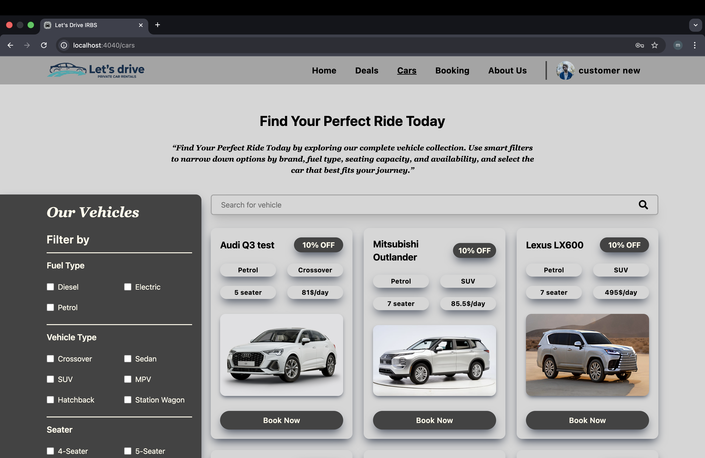
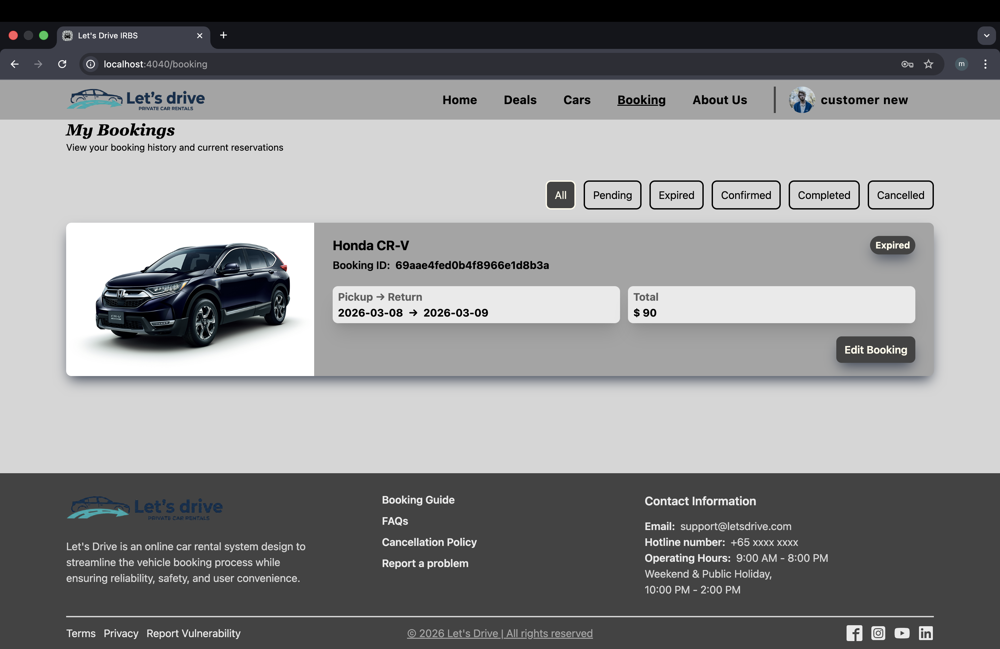

# 🚗 IRBS Car Rental — Customer UI

> **Individual Project — BSc Computer Science**
> Built over 4 months as a real-world, production-grade car rental web application.

IRBS (Intelligent Rental Booking System) is a full-stack car rental platform designed and developed as a BSc Computer Science individual project. The goal was to go beyond a typical academic project and build something that mirrors a real-world product — with clean architecture, a responsive UI, and a complete booking workflow.

This repository contains the **Customer-facing UI** — the main interface where users browse cars, make bookings, and manage their accounts.

---

## 🔗 Related Repositories

This project is split across three repositories:

| Repository | Description | Link |
|---|---|---|
| **Customer UI** *(this repo)* | Customer-facing web application | [my-project](https://github.com/Min-Thant794/my-project) |
| **Admin Dashboard** | Internal dashboard for managing cars, bookings & users | [car-rental-admin](https://github.com/Min-Thant794/car-rental-admin) |
| **Backend API** | RESTful API server powering both frontends | [car-rental-backend](https://github.com/Min-Thant794/car-rental-backend) |

---

## ✨ Features

- 🔐 **User Authentication** — Secure register and login with JWT-based session management
- 🚘 **Car Browsing & Search** — Browse the full fleet with filtering and search functionality
- 📅 **Booking System** — Select dates, choose a car, and confirm a rental booking
- 👤 **Profile Management** — View and update personal account details
- 📱 **Responsive Design** — Fully responsive layout built with Tailwind CSS

---

## 🛠️ Tech Stack

| Layer | Technology |
|---|---|
| **Framework** | React.js |
| **Styling** | Tailwind CSS |
| **Auth** | JWT (JSON Web Tokens) |
| **HTTP Client** | Axios |
| **State Management** | React Context API / useState |
| **Backend** | Node.js + Express *(separate repo)* |
| **Database** | MongoDB *(managed via backend)* |

---

## 🗂️ Project Structure

```
my-project/
├── public/
│   └── index.html
├── src/
│   ├── assets/          # Images and static files
│   ├── components/      # Reusable UI components
│   ├── pages/           # Route-level page components
│   ├── context/         # Auth and global state context
│   ├── services/        # API call functions (Axios)
│   ├── utils/           # Helper functions
│   ├── App.jsx          # Root component & routing
│   └── main.jsx         # Entry point
├── .env.example
├── package.json
└── README.md
```

---

## 🚀 Getting Started

### Prerequisites

Make sure you have the following installed:

- [Node.js](https://nodejs.org/) (v18 or above)
- [npm](https://www.npmjs.com/) or [yarn](https://yarnpkg.com/)
- The [Backend API](https://github.com/Min-Thant794/car-rental-backend) running locally

### Installation

**1. Clone the repository**

```bash
git clone https://github.com/Min-Thant794/my-project.git
cd my-project
```

**2. Install dependencies**

```bash
npm install
```

**3. Set up environment variables**

Create a `.env` file in the root directory:

```env
VITE_API_BASE_URL=http://localhost:5000/api
```

> Update the URL to match wherever your backend is running.

**4. Start the development server**

```bash
npm run dev
```

The app will be running at `http://localhost:5173`

---

## 🔑 Environment Variables

| Variable | Description | Example |
|---|---|---|
| `VITE_API_BASE_URL` | Base URL of the backend API | `http://localhost:5000/api` |

---

## 🧭 Pages Overview

| Page | Route | Description |
|---|---|---|
| Home | `/` | Landing page with car highlights |
| Login | `/login` | User login |
| Register | `/register` | New user registration |
| Cars | `/cars` | Browse and search all available cars |
| Car Detail | `/cars/:id` | View details and book a specific car |
| Bookings | `/bookings` | View current and past bookings |
| Profile | `/profile` | Manage personal account information |

---

## 🖼️ Screenshots

| Home Page | Car Listing | Booking |
|---|---|---|




---

## 🏗️ System Architecture

```
┌─────────────────────┐      ┌─────────────────────┐
│   Customer UI        │      │   Admin Dashboard    │
│   (React + Tailwind) │      │   (React + Tailwind) │
└────────┬────────────┘      └──────────┬──────────┘
         │                              │
         │          REST API            │
         └──────────────┬───────────────┘
                        │
               ┌────────▼────────┐
               │  Backend API     │
               │ (Node + Express) │
               └────────┬────────┘
                        │
               ┌────────▼────────┐
               │    MongoDB       │
               └─────────────────┘
```

---

## 👨‍💻 About the Project

IRBS was developed as a **BSc Computer Science Individual Project** over the course of **4 months**. The aim was to treat it not as a simple university assignment, but as a real-world application — with a proper separation of concerns across three repositories (Customer UI, Admin Dashboard, and Backend API), RESTful API design, JWT-based authentication, and a clean, responsive user interface.

---

## 📄 License

This project is for academic purposes. All rights reserved © Min Thant.